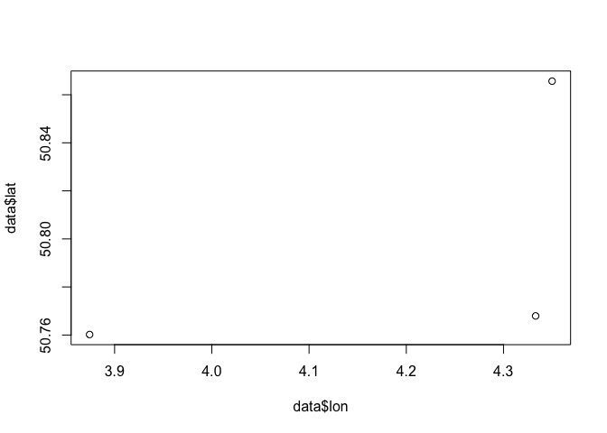
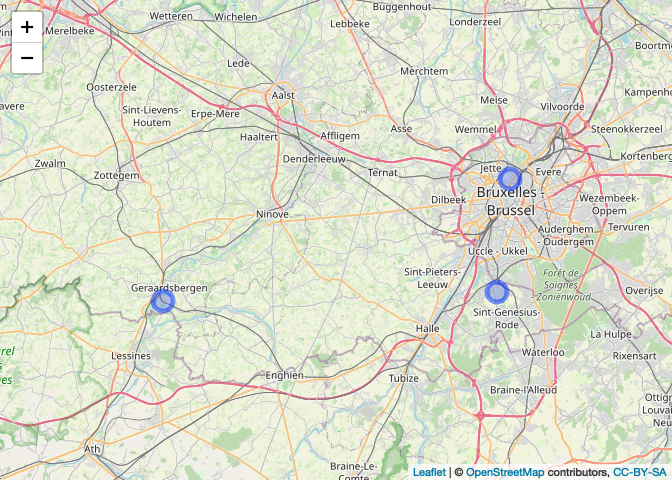

*General note: migration to the more actively developed `sf` package is
currently advised by the `sp` maintainer.* *The `sp` package, used in
this tutorial, is still maintained in order to support the newest
versions of the GDAL and PROJ backends.*

## Introduction

The required packages are **leaflet** and **sp**.

``` r
library(leaflet)
library(sp)
```

## Dummy data

Let’s create a dummy `data.frame` to play around, i.e. the three
locations of INBO:

``` r
names <- c("VAC HT", "Geraardsbergen", "Linkebeek")
lat <- c(50.865664, 50.760201, 50.767950)
lon <- c(4.349944, 3.874300, 4.333044)
data <- data.frame(names, lat, lon)
```

We created three points:

``` r
plot(data$lon, data$lat)
```

<!-- -->

## Creating a map

We need to convert the `data.frame` to a `SpatialPointsDataFrame`:

``` r
crs_wgs84 <- CRS(SRS_string = "EPSG:4326")
pts <- SpatialPointsDataFrame(data[c("lon","lat")], 
                              data[!(names(data) %in% c("lon","lat"))],
                              proj4string = crs_wgs84)
```

The `leaflet` package is ideal to create a basic interactive map:

``` r
library(leaflet)
leaf_map <-
  leaflet(pts) %>% 
  addTiles(group = "OSM") %>%
  addCircleMarkers()
```

``` r
leaf_map
```

<!-- -->

**Nice, no?!**

More information is provided [at the leaflet information
website](https://rstudio.github.io/leaflet/)!
