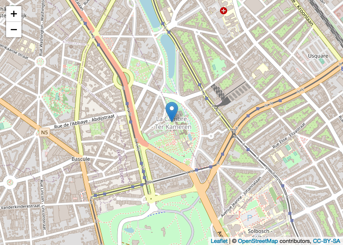

*General note: migration to the more actively developed `sf` package is
currently advised by the `sp` maintainer.* *The `sp` package, used in
this tutorial, is still maintained in order to support the newest
versions of the GDAL and PROJ backends.*

Sometimes we have a layer in one coordinate reference system (CRS) and
need to transform it into another coordinate reference system. The first
thing we need to do is identifying both coordinate reference systems.
Let’s create an example and identify the coordinate reference system
with `wkt()`. We used the coordinates posted on the contact page of
[NGI](http://www.ngi.be/NL/NL5.shtm).

``` r
library(sp)
library(leaflet)
library(widgetframe)
```

    ## Loading required package: htmlwidgets

``` r
ngi <- data.frame(x = 650381.78, y = 667603.12)
coordinates(ngi) <- ~x + y
wkt(ngi)  # show the CRS of an sp object
```

    ## Warning in wkt(ngi): CRS object has no comment

    ## NULL

`NULL` indicates that the coordinate reference system isn’t set. So we
need to set it manually. In this case we know it is “Lambert 2008”. We
need to know the related ‘WKT2 string’. The WKT2 string (well known
text) is a recent open standard by the Open Geospatial Consortium to
represent a coordinate reference system (CRS) - and it replaces the
older (deprecated) PROJ.4 string.

Most coordinate reference systems have an
[EPSG](https://en.wikipedia.org/wiki/International_Association_of_Oil_%26_Gas_Producers#European_Petroleum_Survey_Group)
code which you can find at <http://epsg.io/>. The EPSG code for “Lambert
2008” is 3812. Let’s set this coordinate reference system to our
dataset. `CRS()` defines the coordinate reference system.

``` r
proj4string(ngi) <- CRS(SRS_string = "EPSG:3812")
```

    ## Warning in showSRID(SRS_string, format = "PROJ", multiline = "NO", prefer_proj
    ## = prefer_proj): Discarded datum European Terrestrial Reference System 1989 in
    ## Proj4 definition

The `proj4string()` function refers to the older PROJ.4 strings to
represent a CRS, which the `sp` package can still return for backward
compatibility. The warning above demonstrates that some PROJ.4
information is not supported anymore. `sp` now uses the much better WKT2
representation, which it will derive directly from the EPSG-code that we
provided (even though the function to assign a CRS to an object is still
called `proj4string()`). The WKT2 string is what the geospatial GDAL and
PROJ libraries (the background workhorses) work with since PROJ &gt;= 6,
and it looks like this:

``` r
wkt_lambert2008 <- wkt(ngi)
cat(wkt_lambert2008)
```

    ## PROJCRS["ETRS89 / Belgian Lambert 2008",
    ##     BASEGEOGCRS["ETRS89",
    ##         DATUM["European Terrestrial Reference System 1989",
    ##             ELLIPSOID["GRS 1980",6378137,298.257222101,
    ##                 LENGTHUNIT["metre",1]]],
    ##         PRIMEM["Greenwich",0,
    ##             ANGLEUNIT["degree",0.0174532925199433]],
    ##         ID["EPSG",4258]],
    ##     CONVERSION["Belgian Lambert 2008",
    ##         METHOD["Lambert Conic Conformal (2SP)",
    ##             ID["EPSG",9802]],
    ##         PARAMETER["Latitude of false origin",50.797815,
    ##             ANGLEUNIT["degree",0.0174532925199433],
    ##             ID["EPSG",8821]],
    ##         PARAMETER["Longitude of false origin",4.35921583333333,
    ##             ANGLEUNIT["degree",0.0174532925199433],
    ##             ID["EPSG",8822]],
    ##         PARAMETER["Latitude of 1st standard parallel",49.8333333333333,
    ##             ANGLEUNIT["degree",0.0174532925199433],
    ##             ID["EPSG",8823]],
    ##         PARAMETER["Latitude of 2nd standard parallel",51.1666666666667,
    ##             ANGLEUNIT["degree",0.0174532925199433],
    ##             ID["EPSG",8824]],
    ##         PARAMETER["Easting at false origin",649328,
    ##             LENGTHUNIT["metre",1],
    ##             ID["EPSG",8826]],
    ##         PARAMETER["Northing at false origin",665262,
    ##             LENGTHUNIT["metre",1],
    ##             ID["EPSG",8827]]],
    ##     CS[Cartesian,2],
    ##         AXIS["easting (X)",east,
    ##             ORDER[1],
    ##             LENGTHUNIT["metre",1]],
    ##         AXIS["northing (Y)",north,
    ##             ORDER[2],
    ##             LENGTHUNIT["metre",1]],
    ##     USAGE[
    ##         SCOPE["Engineering survey, topographic mapping."],
    ##         AREA["Belgium - onshore."],
    ##         BBOX[49.5,2.5,51.51,6.4]],
    ##     ID["EPSG",3812]]

We could verify the correctness of this position by plotting it on a
map. Here we use the `leaflet` package which requires the data to be in
the “WGS84” coordinate reference system. Therefore we use
`spTransform()` to do this transformation. “WGS84” has EPSG code 4326.

``` r
ngi_ll <- spTransform(ngi, CRS(SRS_string = "EPSG:4326"))
cat(wkt(ngi_ll))
```

    ## GEOGCRS["WGS 84 (with axis order normalized for visualization)",
    ##     DATUM["World Geodetic System 1984",
    ##         ELLIPSOID["WGS 84",6378137,298.257223563,
    ##             LENGTHUNIT["metre",1]],
    ##         ID["EPSG",6326]],
    ##     PRIMEM["Greenwich",0,
    ##         ANGLEUNIT["degree",0.0174532925199433],
    ##         ID["EPSG",8901]],
    ##     CS[ellipsoidal,2],
    ##         AXIS["geodetic longitude (Lon)",east,
    ##             ORDER[1],
    ##             ANGLEUNIT["degree",0.0174532925199433,
    ##                 ID["EPSG",9122]]],
    ##         AXIS["geodetic latitude (Lat)",north,
    ##             ORDER[2],
    ##             ANGLEUNIT["degree",0.0174532925199433,
    ##                 ID["EPSG",9122]]]]

``` r
leaflet(ngi_ll) %>%
  addTiles() %>%
  addMarkers() # %>%
```

<!-- -->

``` r
  #frameWidget()
```

*Note: run the code to see the interactive map.*

| CRS                             |  EPSG |
|:--------------------------------|------:|
| WGS 84                          |  4326 |
| Belge 1972 / Belgian Lambert 72 | 31370 |
| ETRS89 / Belgian Lambert 2008   |  3812 |
| WGS 84 / Pseudo-Mercator        |  3857 |

Relevant projections for Belgian data. CRS = Coordinate reference
system, EPSG = CRS code in the EPSG dataset.
